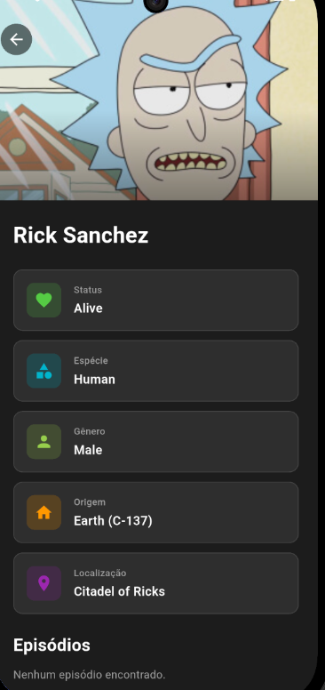
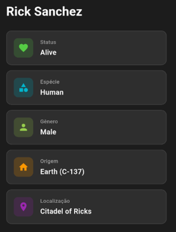

# Rick & Morty Explorer 🌌


Uma aplicação Flutter premium, moderna e responsiva para explorar o universo de Rick e Morty. Construída com foco em excelência de UI/UX, performance e arquitetura limpa.



## ✨ Principais Funcionalidades

- **🚀 Navegação Moderna**: Transições fluidas e suporte a deep linking usando `go_router`.
- **📱 Totalmente Responsivo**: Layouts adaptativos que ficam ótimos em Mobile, Tablet e Desktop.
  - **Grids Dinâmicos**: Listas se transformam em grids em telas maiores.
  - **Restrições de Conteúdo**: Largura máxima controlada para leitura confortável em monitores.
- **🎨 UI Premium**:
  - **Tema Escuro**: Paleta de cores imersiva "Space Dark" (`#1E1E1E`).
  - **Carregamento Skeleton**: Efeitos de chimmer suaves durante o carregamento de dados.
  - **Imagens em Alta Resolução**: Cache de imagens otimizado com `cached_network_image`.
- **🔍 Busca Poderosa**:
  - **Busca com Debounce**: Filtragem eficiente em tempo real para Personagens, Episódios e Locais.
  - **Filtragem Inteligente**: Busca heurística para códigos de episódios (ex: "S01E01").
- **⚡ Performance**:
  - **Paginação**: Rolagem infinita para grandes conjuntos de dados.
  - **Gerenciamento de Estado**: Manipulação eficiente de estado com `Provider`.

## 🛠️ Tecnologias Utilizadas

- **Framework**: Flutter
- **Linguagem**: Dart
- **Gerenciamento de Estado**: Provider
- **Navegação**: GoRouter
- **Rede**: HTTP
- **Assets**: Cached Network Image, Flutter Launcher Icons
- **Arquitetura**: MVVM (Model-View-ViewModel)

## 📸 Capturas de Tela

|         Visualização Desktop          |               Detalhe Mobile               |
| :-----------------------------------: | :----------------------------------------: |
|  |  |

## 🚀 Começando

### Pré-requisitos

- Flutter SDK `^3.7.2`
- Dart SDK

### Instalação

1. **Clone o repositório**

   ```bash
   git clone https://github.com/augusto49/rickmorty.git
   cd rickmorty
   ```

2. **Instale as dependências**

   ```bash
   flutter pub get
   ```

3. **Execute o app**
   ```bash
   flutter run
   ```

## 📂 Estrutura do Projeto

```
lib/
├── data/           # Modelos e serviços de API
├── viewmodels/     # Lógica de gerenciamento de estado (Providers)
├── views/          # Componentes de UI
│   ├── pages/      # Telas completas da aplicação
│   └── widgets/    # Elementos de UI reutilizáveis
├── router/         # Configuração de navegação
└── main.dart       # Ponto de entrada
```

## 🤝 Contribuindo

Contribuições são bem-vindas! Sinta-se à vontade para enviar um Pull Request.

1. Faça um Fork do Projeto
2. Crie sua Branch de Feature (`git checkout -b feature/MinhaFeatureIncrivel`)
3. Faça o Commit de suas Mudanças (`git commit -m 'Adiciona alguma FeatureIncrível'`)
4. Faça o Push para a Branch (`git push origin feature/MinhaFeatureIncrivel`)
5. Abra um Pull Request

## 📄 Licença

Este projeto é open source e está disponível sob a [Licença MIT](LICENSE).

---

_Desenvolvido com ❤️ usando Flutter_
